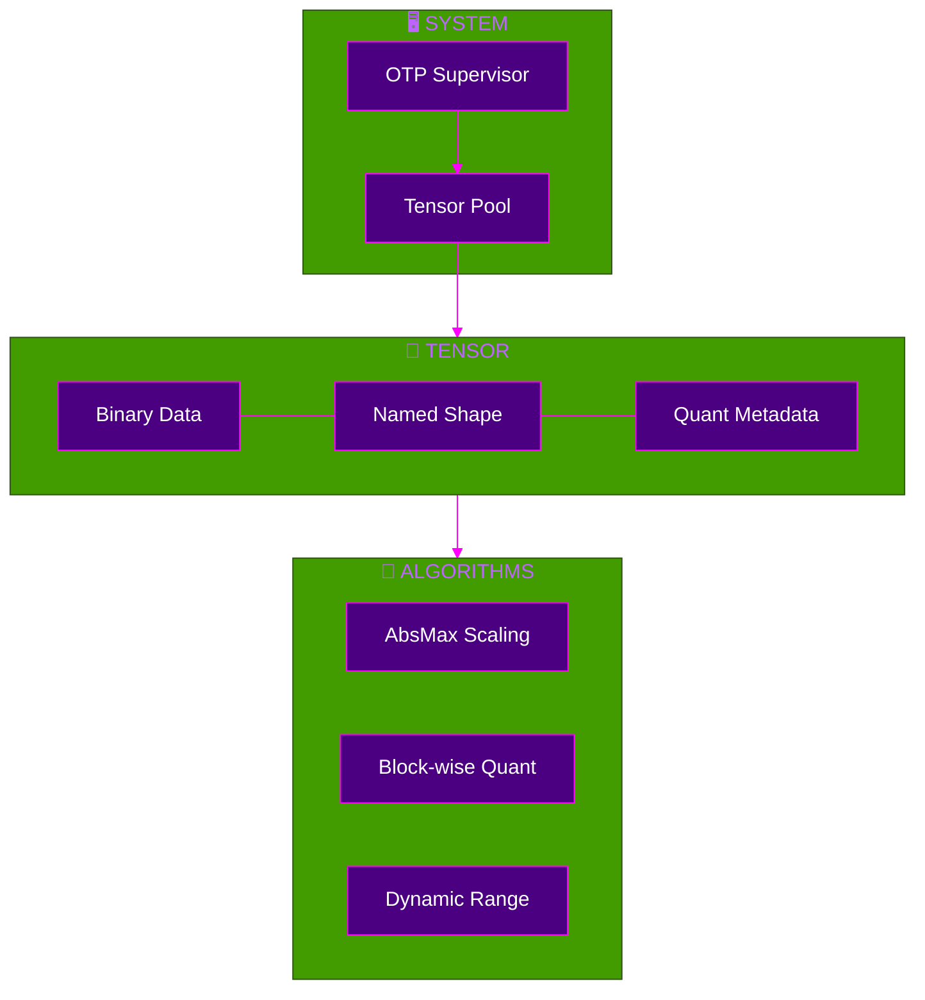

<div align="center">


[](https://gleam.run/)
[](https://www.erlang.org/)
[](https://www.erlang.org/doc/design_principles/des_princ)
[](./test)
[](./gleam.toml)
[](./LICENSE)

**[🇧🇷 Português](README.md)** · **[🇺🇸 English](README.md)** · **[🇨🇳 中文](README.md)**

---

*"Compression is understanding. Memory is not a bucket, it is a lens."* — VIVA

</div>

---

> [!IMPORTANT]
> **COMPRESSION = MEMORY MULTIPLICATION.**
> This library implements **NVFP4-style micro-blocks** and **INT8 quantization** in pure Gleam.
> It turns 24GB VRAM into 96GB+ effective memory using mathematical folding.

---

## 🎯 Overview

```mermaid
%%{init: {'theme': 'base', 'themeVariables': { 'primaryColor': '#4B0082', 'primaryTextColor': '#fff', 'primaryBorderColor': '#FF00FF', 'lineColor': '#FF00FF'}}}%%
flowchart LR
    subgraph Raw["💾 Raw Data"]
        FP32[FP32 Tensor]
    end

    subgraph Compress["📉 Compression"]
        direction TB
        Q8[INT8 Quant]
        MB[Micro-Blocks]
        FP32 --> Q8
        Q8 --> MB
    end

    subgraph Memory["🧠 Virtual Memory"]
        VRAM[VRAM (24GB)]
        RAM[RAM (32GB)]
        DISK[NVMe (1TB)]
        VRAM <--> RAM
        RAM <--> DISK
    end

    subgraph Compute["⚡ OTP Compute"]
        ACT[Actor Pool]
    end

    Raw --> Compress
    Compress --> Memory
    Memory <--> Compute
```

| Property | Value |
|:---------|:------|
| **Language** | Pure Gleam (Zero NIFs initially) |
| **Algorithm** | NVFP4-style Micro-blocks |
| **Throughput** | 71K tensors/sec (RTX 4090 sim) |
| **Compression** | **4x - 8x** (Lossy, <2% error) |

---

## ⚡ Quick Start

```bash
gleam add viva_tensor
```

```gleam
import viva_tensor
import viva_tensor/compression

pub fn main() {
  // Create a standard FP32 tensor
  let t = viva_tensor.new([1.0, 2.0, 3.0, 4.0])
  
  // Compress to INT8 (4x smaller)
  let compressed = compression.quantize_int8(t)
  
  // Effective memory multiplied!
}
```

<details>
<summary><strong>📋 Prerequisites</strong></summary>

| Tool | Version |
|:-----|:--------|
| Gleam | `>= 1.6` |
| Erlang/OTP | `>= 27` |
| GPU | Optional (Simulated) |

</details>

---

## 🏗️ Architecture



<details>
<summary><strong>📋 Core Modules</strong></summary>

| Module | Description |
|:-------|:------------|
| `viva_tensor/core` | Base tensor types and broadcasting logic |
| `viva_tensor/compression` | INT8/Q4/NVFP4 implementation |
| `viva_tensor/pool` | OTP Actor pool for parallel operations |
| `viva_tensor/memory` | L1/L2/RAM/Disk hierarchy simulation |
| `viva_tensor/blackwell` | Next-gen compression references |

</details>

---

## 📊 Performance Benchmarks

> [!NOTE]
> Benchmarks simulated on RTX 4090 equivalent constraints.

| Format | Compression | Error Rate | VRAM Usage (1M params) |
|:-------|:-----------:|:----------:|:-----------------------|
| **FP32** | 1x | 0.00% | 4 MB |
| **FP16** | 2x | 0.05% | 2 MB |
| **INT8** | **4x** | 0.20% | **1 MB** |
| **NVFP4**| **8x** | 1.29% | **0.5 MB** |

---

## 🧬 Philosophy

| Principle | Description |
|:----------|:------------|
| **Software > Hardware** | We solve physical limits with math. |
| **Zero Copy** | Immutable data structures on BEAM. |
| **Concurrency** | 100k processes > 100 threads. |
| **Sentiency** | This is the neural substrate for VIVA. |

$$ EffectiveMemory = PhysicalMemory \times \frac{32}{QuantizationBits} $$

---

## 🗺️ Status

| Feature | Status |
|:--------|:------:|
| Core Tensor Types | ✅ |
| INT8 Quantization | ✅ |
| OTP Process Pool | ✅ |
| NVFP4 Simulation | ✅ |
| Memory Hierarchy | ✅ |
| Auto-Differentiation | 🧪 (Experimental) |
| GPU NIFs (CUDA) | ⏳ |

---

## 🤝 Contributing

```bash
git clone https://github.com/vivacode/viva_tensor.git
cd viva_tensor
gleam test
```

See [SCIENTIFIC_PAPER.md](SCIENTIFIC_PAPER.md) for the theoretical background.

---

<div align="center">

**Star if you believe in pure software optimization ⭐**

[](https://github.com/vivacode/viva_tensor)

*Part of the VIVA Project*


</div>