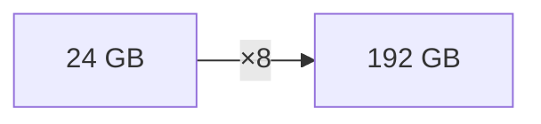
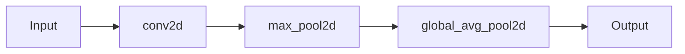
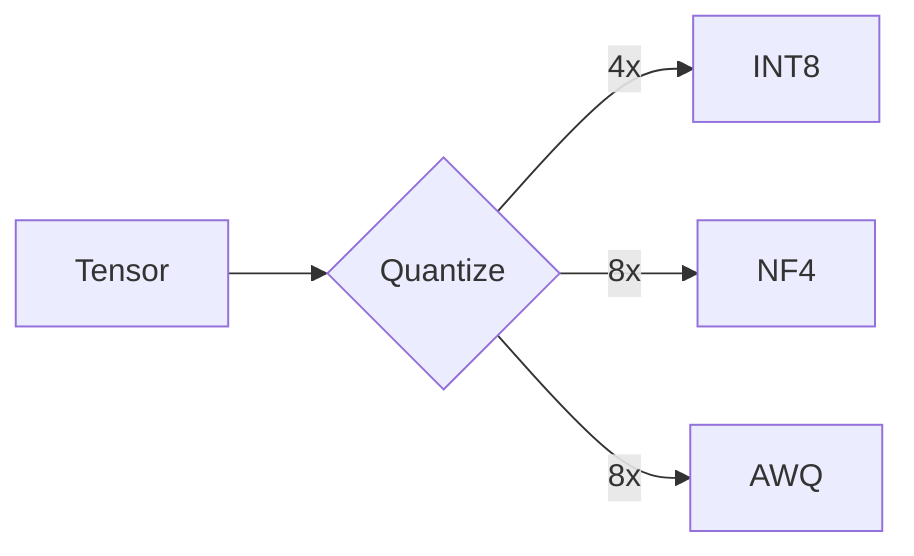

<div align="center">


[](https://gleam.run/)
[](https://github.com/gabrielmaialva33/viva_tensor/actions)
[](./LICENSE)

</div>

---



---

## Install

```bash
gleam add viva_tensor
```

## Use

```gleam
import viva_tensor as t

// Basic tensors
let a = t.zeros([28, 28])
let b = t.random_uniform([3, 3])

// Conv2D
let output = t.conv2d(a, b, t.conv2d_same(3, 3))

// Pooling
let pooled = t.max_pool2d(output, 2, 2, 2, 2)
```

## CNN Operations



| Function | Description |
|----------|-------------|
| `conv2d` | 2D convolution with stride/padding |
| `conv2d_same` | "Same" padding config |
| `pad2d/pad4d` | Zero padding |
| `max_pool2d` | Max pooling |
| `avg_pool2d` | Average pooling |
| `global_avg_pool2d` | Global average pooling |

## Quantization

```gleam
import viva_tensor/nf4

let small = nf4.quantize(big_tensor, nf4.default_config())
// 8x less memory
```

## Algorithms



| | Compression | Efficiency |
|:--|:-----------:|:----------:|
| **INT8** | 4x | 40% |
| **NF4** | 7.5x | 77% |
| **AWQ** | 7.7x | 53% |

## Build

```bash
make test
make bench
```

## Docs

[docs/](docs/) — PT-BR, EN, 中文

---

<div align="center">


</div>
