<div align="center">


[](https://gleam.run/)
[](./test)
[](./LICENSE)

**The fastest tensor library on the BEAM**

</div>

---

## Performance


> **viva_tensor** (green) vs **PyTorch** (red) vs **NumPy** (blue)

### Verified Benchmarks

| Size | viva_tensor | PyTorch | NumPy | vs PyTorch |
|:----:|:-----------:|:-------:|:-----:|:----------:|
| 2000×2000 | **513 ±13** | 442 ±33 | 453 ±115 | **+16%** |
| 3000×3000 | **512 ±80** | 486 ±16 | 511 ±17 | **+5%** |
| 4000×4000 | **592 ±8** | 516 ±35 | 567 ±5 | **+15%** |
| 5000×5000 | **649 ±22** | 535 ±11 | 576 ±28 | **+21%** |

<details>
<summary>📊 Methodology & Environment</summary>


**Environment:**
- Hardware: Intel i7-13700K (24 threads)
- OS: WSL2 Ubuntu 22.04
- BLAS: Intel MKL 2020.4
- Reference: Kalibera & Jones (2013)

**Reproduce:**
```bash
python3 bench/benchmark.py
Rscript bench/analysis.R  # Statistical analysis
```

</details>

---

## Install

```bash
gleam add viva_tensor
```

## Architecture


## Backend Selection


## Quick Start

```gleam
import viva_tensor as t

// Create tensors
let a = t.zeros([1000, 1000])
let b = t.random_uniform([1000, 1000])

// Matrix multiplication @ 649 GFLOPS
let c = t.matmul(a, b)

// Activations (SIMD vectorized)
let activated = t.relu(c) |> t.sigmoid()
```

## Features


### Quantization

```mermaid
flowchart LR
    A[FP32 Tensor<br/>24 GB] -->|quantize| B{Method}
    B -->|INT8| C[6 GB<br/>4× smaller]
    B -->|NF4| D[3.2 GB<br/>7.5× smaller]
    B -->|AWQ| E[3.1 GB<br/>7.7× smaller]

    style A fill:#FF6B6B
    style C fill:#4ECDC4
    style D fill:#2E8B57
    style E fill:#9B59B6
```



| Method | Compression | Quality | Use Case |
|:------:|:-----------:|:-------:|:--------:|
| INT8 | 4× | 96% | Inference |
| NF4 | 7.5× | 99% | QLoRA Fine-tuning |
| AWQ | 7.7× | 97% | Edge Deployment |

## Build

```bash
# Pure Gleam (no native deps)
gleam build && gleam test

# With native acceleration
cd zig_src && zig build
cp zig-out/lib/libviva_tensor_zig.so ../priv/
```

## Documentation

| Language | Link |
|:--------:|:----:|
| English | [docs/en/](docs/en/) |
| Português | [docs/pt-br/](docs/pt-br/) |
| 中文 | [docs/zh-cn/](docs/zh-cn/) |

---

<div align="center">


**Built with love for the BEAM**


</div>
