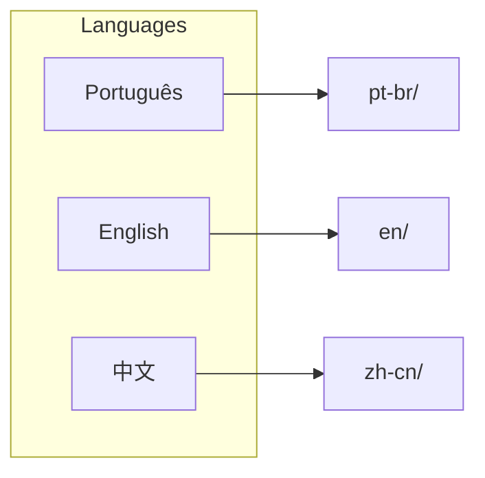

# Documentation



| | Docs | API | Paper |
|:--|:----:|:---:|:-----:|
| **PT-BR** | [README](pt-br/README.md) | [api](pt-br/api.md) | [paper](pt-br/paper.md) |
| **EN** | [README](en/README.md) | [api](en/api.md) | [paper](en/paper.md) |
| **中文** | [README](zh-cn/README.md) | [api](zh-cn/api.md) | [paper](zh-cn/paper.md) |

## Metrics

```json
{
  "int8": { "compression": "4x", "efficiency": "40%" },
  "nf4":  { "compression": "7.5x", "efficiency": "77%" },
  "awq":  { "compression": "7.7x", "efficiency": "53%" }
}
```
