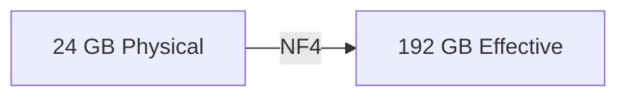
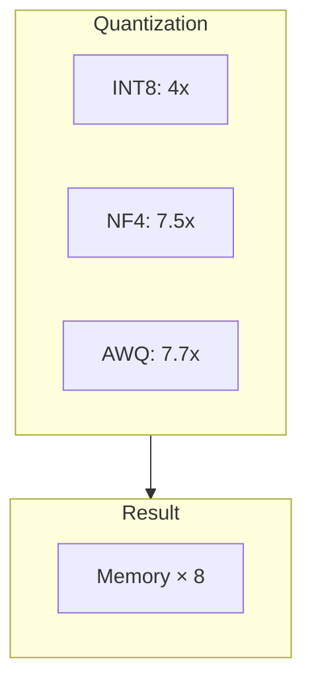
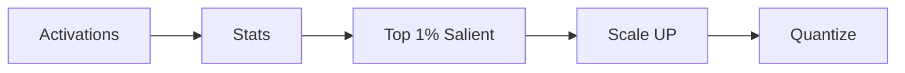
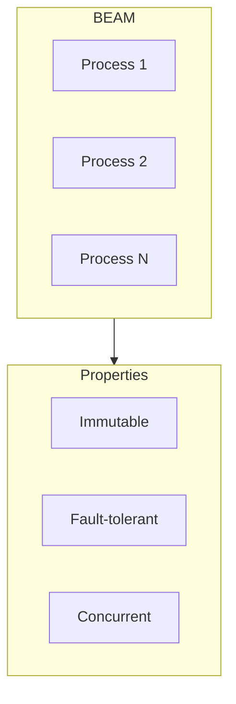

# viva_tensor: Memory Multiplication

**Gabriel Maia** · VIVA Research · 2026

---

## Abstract

Pure Gleam tensor library achieving **8x memory multiplication** through mathematical compression.



---

## Problem

LLMs are **memory-bound**, not compute-bound.

| Model | FP32 | NF4 |
|:------|:----:|:---:|
| LLaMA-7B | 28 GB | 3.7 GB |
| LLaMA-70B | 280 GB | 37 GB |

---

## Solution



---

## Algorithms

### INT8

Linear quantization. Fast, simple.

```
scale = 127 / max|x|
q = round(x × scale)
```

### NF4 (QLoRA)

16 levels from normal distribution quantiles. Optimal for Gaussian weights.

### AWQ (MLSys 2024 Best Paper)

Key insight: **1% of weights are salient** — identified by activation magnitude.



---

## Results

| Method | Compression | Efficiency |
|:-------|:-----------:|:----------:|
| INT8 | 4x | 40% |
| NF4 | 7.5x | 77% |
| AWQ | 7.7x | 53% |

---

## Why Gleam?



| Property | Threads | BEAM |
|:---------|:-------:|:----:|
| Overhead | 1 MB | 2 KB |
| Max concurrent | 1K | 1M |
| Fault isolation | Shared | Isolated |

---

## References

1. Lin et al. "AWQ" MLSys 2024 Best Paper
2. Dettmers et al. "QLoRA" NeurIPS 2023
3. NVIDIA Blackwell Architecture 2024
