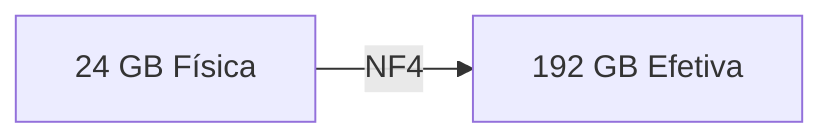
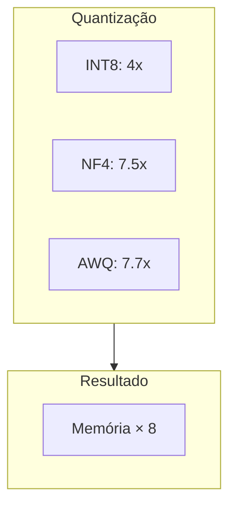
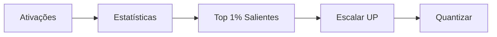
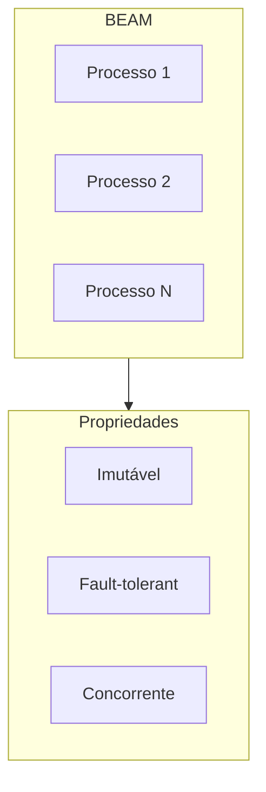

# viva_tensor: Multiplicação de Memória

**Gabriel Maia** · VIVA Research · 2026

---

## Resumo

Biblioteca de tensors em Pure Gleam com **8x multiplicação de memória** via compressão matemática.



---

## Problema

LLMs são **memory-bound**, não compute-bound.

| Modelo | FP32 | NF4 |
|:-------|:----:|:---:|
| LLaMA-7B | 28 GB | 3.7 GB |
| LLaMA-70B | 280 GB | 37 GB |

---

## Solução



---

## Algoritmos

### INT8

Quantização linear. Rápido, simples.

```
scale = 127 / max|x|
q = round(x × scale)
```

### NF4 (QLoRA)

16 níveis dos quantis da distribuição normal. Ótimo para pesos gaussianos.

### AWQ (MLSys 2024 Best Paper)

Insight: **1% dos pesos são salientes** — identificados pela magnitude das ativações.



---

## Resultados

| Método | Compressão | Eficiência |
|:-------|:----------:|:----------:|
| INT8 | 4x | 40% |
| NF4 | 7.5x | 77% |
| AWQ | 7.7x | 53% |

---

## Por que Gleam?



| Propriedade | Threads | BEAM |
|:------------|:-------:|:----:|
| Overhead | 1 MB | 2 KB |
| Max concorrente | 1K | 1M |
| Isolamento | Compartilhado | Isolado |

---

## Referências

1. Lin et al. "AWQ" MLSys 2024 Best Paper
2. Dettmers et al. "QLoRA" NeurIPS 2023
3. NVIDIA Blackwell Architecture 2024
