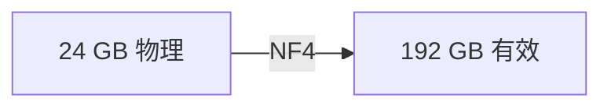
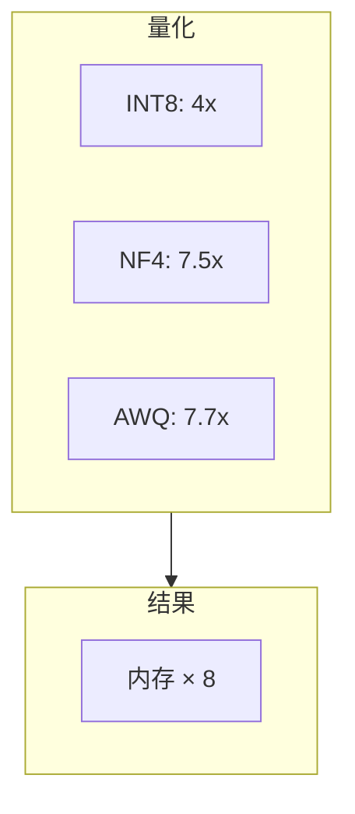
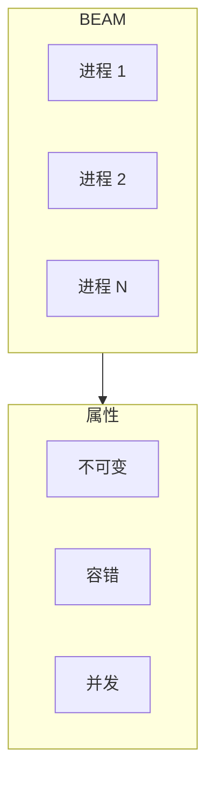

# viva_tensor: 内存倍增

**Gabriel Maia** · VIVA Research · 2026

---

## 摘要

纯 Gleam 张量库，通过数学压缩实现 **8倍内存倍增**。



---

## 问题

LLM 是**内存受限**的，而非计算受限。

| 模型 | FP32 | NF4 |
|:-----|:----:|:---:|
| LLaMA-7B | 28 GB | 3.7 GB |
| LLaMA-70B | 280 GB | 37 GB |

---

## 解决方案



---

## 算法

### INT8

线性量化。快速、简单。

```
scale = 127 / max|x|
q = round(x × scale)
```

### NF4 (QLoRA)

16个级别来自正态分布分位数。对高斯权重最优。

### AWQ (MLSys 2024 最佳论文)

关键洞察：**1% 的权重是显著的** — 由激活幅度识别。


---

## 结果

| 方法 | 压缩比 | 效率 |
|:-----|:------:|:----:|
| INT8 | 4x | 40% |
| NF4 | 7.5x | 77% |
| AWQ | 7.7x | 53% |

---

## 为什么选择 Gleam？



| 属性 | 线程 | BEAM |
|:-----|:----:|:----:|
| 开销 | 1 MB | 2 KB |
| 最大并发 | 1K | 1M |
| 故障隔离 | 共享 | 隔离 |

---

## 参考文献

1. Lin et al. "AWQ" MLSys 2024 最佳论文
2. Dettmers et al. "QLoRA" NeurIPS 2023
3. NVIDIA Blackwell Architecture 2024
